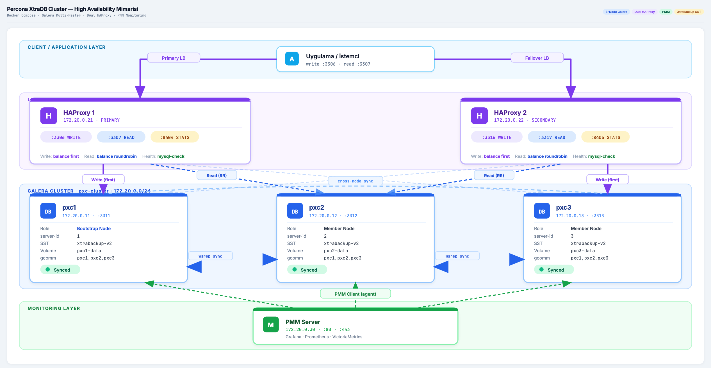
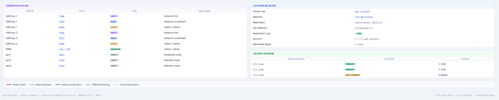

# PXC High Availability Cluster

Percona XtraDB Cluster (Galera Multi-Master) + Dual HAProxy + Traefik + PMM Monitoring — Docker Compose ile tam otomatik kurulum.

---

## Mimari Diyagram

[](https://mertyakan.github.io/pxc-ha-case/ss/mimari-diyagram-animated.html)




---

## Mimari

```
Uygulama / İstemci
    └── Traefik (172.20.0.20)  →  :3306 Write  |  :3307 Read  |  :8080 Dashboard
              │
              ├── HAProxy 1 (172.20.0.21)  →  :8404 Stats  [Active]
              └── HAProxy 2 (172.20.0.22)  →  :8405 Stats  [Active]
                        │
                        ├── pxc1 (172.20.0.11:3311)  ←→  Galera wsrep sync
                        ├── pxc2 (172.20.0.12:3312)  ←→  Galera wsrep sync
                        └── pxc3 (172.20.0.13:3313)
                                  │
                              PMM Server (172.20.0.30)  :80 / :443
```

**Replication:** Synchronous (Galera)  
**SST Method:** xtrabackup-v2  
**Quorum:** 2/3 node gerekli — 1 node kaybında cluster ayakta kalır  
**Load Balancing:** Traefik → HAProxy 1/2 (Active/Active, otomatik failover)

---

## Dosya Yapısı

```
pxc-ha-case/
├── docker-compose.yml            # Tüm servisler ve bağımlılık zinciri
├── setup.sh                      # Otomatik kurulum scripti
├── check-cluster.sh              # Canlı cluster durum dashboard'u
├── traefik/
│   ├── traefik.yml               # Traefik static config (entrypoints, provider)
│   └── dynamic.yml               # Traefik dynamic config (TCP routers, backends)
├── haproxy/
│   ├── haproxy1.cfg              # HAProxy 1 konfigürasyonu
│   └── haproxy2.cfg              # HAProxy 2 konfigürasyonu
├── pxc-config/
│   ├── pxc1.cnf                  # PXC Node 1 — bootstrap (gcomm://)
│   ├── pxc2.cnf                  # PXC Node 2 — gcomm://pxc1,pxc2,pxc3
│   └── pxc3.cnf                  # PXC Node 3 — gcomm://pxc1,pxc2,pxc3
└── secrets/
    ├── mysql_root_password.txt   # Root şifresi (setup.sh tarafından üretilir)
    └── xtrabackup_password.txt   # XtraBackup şifresi (setup.sh tarafından üretilir)
```

---

## Kurulum

```bash
git clone https://github.com/mertyakan/pxc-ha-case
cd pxc-ha-case
chmod +x setup.sh
./setup.sh
```

`setup.sh` sırasıyla şunları yapar:

1. `openssl rand` ile güçlü rastgele şifreler üretir
2. PMM Server'ı başlatır, 45 saniye sağlık kontrolü bekler
3. pxc1'i bootstrap eder (`gcomm://`), 60 saniye bekler
4. pxc2 ve pxc3'ü join eder, SST ile senkronize olurlar
5. HAProxy 1 ve 2'yi başlatır
6. Traefik'i başlatır — HAProxy'ler healthy olduktan sonra devreye girer
7. `haproxy_check` kullanıcısı oluşturur (şifresiz, sadece health check)
8. `pmm` kullanıcısı oluşturur
9. `wsrep_cluster_size=3` olana kadar bekler (max 5 dakika)
10. pxc1 config'ini günceller: `gcomm://` → `gcomm://pxc1,pxc2,pxc3`
11. Her node'u PMM'e REST API üzerinden kaydeder

### Servis Bağımlılık Zinciri

```
pmm-server
    └── pxc1 (bootstrap)
            └── pxc2 (joins pxc1)
                    └── pxc3 (joins pxc2)
                            └── haproxy1, haproxy2
                                    └── traefik
```

Her servis bir öncekinin `healthy` durumuna ulaşmasını bekler — race condition olmadan sıralı başlatma.

---

## Erişim

| Servis | Adres | Kullanıcı |
|--------|-------|-----------|
| MySQL Write | `localhost:3306` | root / secrets dosyası |
| MySQL Read | `localhost:3307` | root / secrets dosyası |
| Traefik Dashboard | `http://localhost:8080` | — |
| HAProxy Stats | `http://localhost:8404/stats` | admin / admin |
| HAProxy Stats | `http://localhost:8405/stats` | admin / admin |
| PMM Dashboard | `https://localhost` | admin / admin |
| pxc1 Direct | `localhost:3311` | — |
| pxc2 Direct | `localhost:3312` | — |
| pxc3 Direct | `localhost:3313` | — |

Root şifresine erişmek için:
```bash
cat secrets/mysql_root_password.txt
```

---

## Traefik — Active/Active Load Balancing

Traefik, HAProxy 1 ve 2 önünde tek giriş noktası olarak çalışır. Keepalived/VRRP gerektirmeden Docker network içinde Active/Active sağlar.

```
Uygulama → Traefik :3306/:3307
               ├── HAProxy 1 :3306/:3307  [Active]
               └── HAProxy 2 :3306/:3307  [Active]
```

- Her iki HAProxy aynı anda trafik alır (round-robin)
- Biri düşerse Traefik otomatik diğerine yönlendirir
- Uygulama sadece `localhost:3306` / `localhost:3307` bilir

---

## HAProxy Yük Dağılımı

**Write (`:3306`)** — `balance first`  
pxc1 sağlıklı olduğu sürece tüm write trafiği oraya gider. pxc1 düşerse pxc2 devralır.

**Read (`:3307`)** — `balance roundrobin`  
3 node arasında eşit dağılım. Galera synchronous replication sayesinde hangi node'dan okunursa okunsun veri aynıdır.

**Health Check:** `mysql-check user haproxy_check` — 3 saniyede bir, 3 başarısızlıkta DOWN, 2 başarıda UP.

---

## Cluster Durumu

```bash
./check-cluster.sh
```

Manuel kontrol:
```bash
docker exec pxc1 mysql -uroot -p$(cat secrets/mysql_root_password.txt) \
  -e "SHOW STATUS LIKE 'wsrep%';"
```

---

## Sağlıklı Kapatma

Galera için sıralı kapatma önemlidir — en son kapanan node `safe_to_bootstrap: 1` olarak işaretlenir.

```bash
docker compose stop pxc3 pxc2 pxc1 traefik haproxy1 haproxy2 pmm-server
```

## Yeniden Başlatma

```bash
docker compose start pxc1
# pxc1 healthy olduktan sonra
docker compose start pxc2 pxc3 haproxy1 haproxy2 traefik pmm-server
```

---

## Backup / Restore (XtraBackup)

```bash
# Backup
docker run --rm \
  --network pxc-ha-case_pxc-network \
  -v pxc-ha-case_pxc1-data:/var/lib/mysql:ro \
  -v $(pwd)/backups:/backups \
  percona/percona-xtrabackup:8.0 \
  xtrabackup --backup \
    --host=pxc1 \
    --user=root \
    --password=$(cat secrets/mysql_root_password.txt) \
    --target-dir=/backups/$(date +%Y%m%d_%H%M%S) \
    --no-server-version-check

# Prepare
docker run --rm -v $(pwd)/backups:/backups \
  percona/percona-xtrabackup:8.0 \
  xtrabackup --prepare --target-dir=/backups/<TIMESTAMP>
```

---

## Galera Quorum

| Node Durumu | Cluster | Yazma |
|-------------|---------|-------|
| 3/3 node | PRIMARY | ✓ Açık |
| 2/3 node | PRIMARY | ✓ Açık |
| 1/3 node | NON-PRIMARY | ✗ Kapalı |
